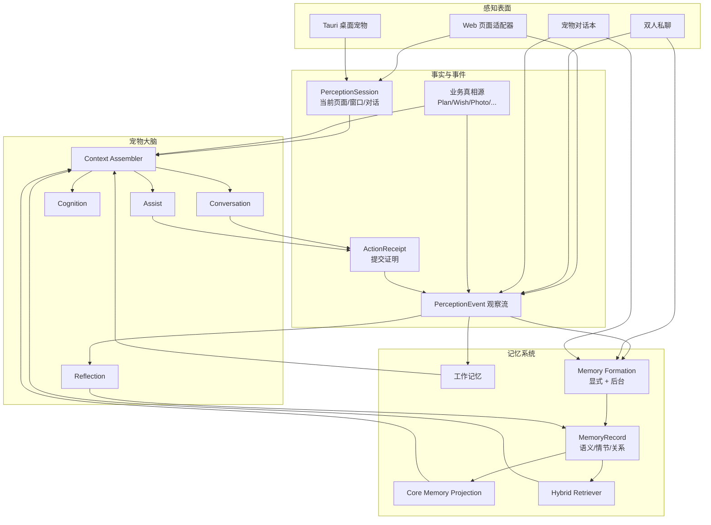
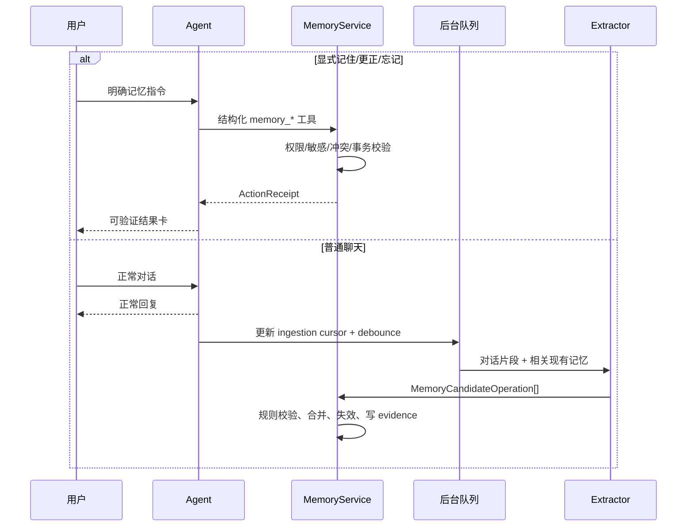

# Kitty Love 全站感知与记忆系统设计

> 状态：目标架构、实施契约与 2026-08-03 核心闭环实现记录
> 调研与代码审计基准：2026-08-03，`master` / `ac3b568`
> 适用范围：Web 主站、伴侣私聊、宠物对话本、Tauri 桌面宠物、后台记忆治理
> 关联文档：[H5 混合智能电子宠物方案](./h5-agentic-pet-architecture.md)、[H5 电子宠物实施计划](./h5-pet-implementation-plan.md)

## 0. 结论

Kitty Love 的宠物不应通过“看见一段 Prompt”来假装理解网站，而应通过一套可验证的感知与记忆基础设施持续获得事实：

1. **全站感知采用“页面语义上下文 + 领域事件 + 当前任务 + 会话状态”四路输入。** 页面只上报结构化语义，不把整页 DOM、鼠标轨迹或敏感输入交给模型。
2. **记忆采用三域隔离。** `user_private` 是个人私有记忆，`couple_shared` 是两个人与双方宠物共享的共同记忆，`companion_relationship` 是某只宠物与其主人的关系记忆。
3. **记忆采用四层。** 工作记忆、语义记忆、情节记忆、关系/交互偏好分别存取；原始聊天和业务表不是长期记忆的同义词。
4. **显式“记住”走即时写入，普通重要聊天走后台沉淀。** 后台抽取在会话安静后执行，支持新增、合并、纠正、失效和撤销，不再按“每五轮一次、看最近十二条”的固定抽样漏记。
5. **双人私聊的重要内容进入情侣共享记忆。** 只把说话者明确表达的事实、共同决定、承诺、稳定偏好和重要经历写入；不能把猜测变成另一方的事实。
6. **业务数据仍以原表为真相源。** 计划、心愿、纪念日、照片、故事、留言、心情、每日一问和未来情书不复制成另一套“记忆数据库”；只有完成心愿等有长期意义的经历才形成情节记忆。
7. **任何“已记录”都必须有写入回执。** 模型文本不是事实。没有成功的工具调用、数据库提交和 `ActionReceipt`，系统不得展示“已经记录/已存档/已创建”。
8. **集成 LangMem 0.0.30 的无状态 Memory Manager，保留现有 PostgreSQL/pgvector 与领域权限。** 借鉴 Letta、Zep/Graphiti、Generative Agents 和 CloudEvents 的成熟设计，但不引入第二套 Agent Runtime、外部记忆 SaaS或独立图数据库。

这不是“把更多字段塞进 Prompt”的改动，而是把感知、事实、记忆、权限、来源和行动证明做成同一套闭环。

### 0.1 本次实现落点

- 数据库已改为 `CoupleSpace`、`MemoryRecord`、`MemoryEvidence`、`MemoryRevision`、`ActionReceipt`、`PerceptionSession/Event`；迁移只搬运安全旧数据，随后直接删除 `MemoryItem/MemoryEmbedding`，没有双写或兼容层。
- `MemoryPolicy` 在任何写入前拒绝本机授权路径、工作区、文件全文、命令输出、密钥和工具状态；污染正文不会以“拒绝日志”的形式再次落库。
- 显式“记住”通过 Conversation 的 `memory_upsert` 同事务返回 committed receipt；普通宠物对话与双人私聊分别由 LangMem 结构化抽取并写入私有域/情侣共享域。
- Conversation、Assist、Cognition、Reflection 全部经过 `ContextAssembler`；检索会更新 `accessCount/lastAccessedAt`，设置页可直接看到“已引用几次”和来源证据。
- 全部生产路由已有确定性的页面语义契约，Web、Tauri 主窗口与桌宠通过服务端感知会话同步当前页面、活动任务与 active Conversation；`/admin`、`/verify` 不上报。
- 主站设置页已提供三域查看、搜索、显式记录、来源查看、纠正、确认、忘记/恢复和自动来源开关。
- PostgreSQL 已验证从空库完整升级，也验证了带一条安全记忆和一条本机授权路径污染记忆的旧库升级结果：只保留安全记录，旧表被删除。

---

## 1. 当前实现审计

### 1.1 已有基础

当前项目已经具备可复用的骨架：

- `Conversation` / `ChatMessage` / `ConversationSummary` 保存宠物对话和滚动摘要。
- `MemoryItem` / `MemoryEmbedding` 使用 PostgreSQL、pg_trgm 与 pgvector 做词法和语义检索。
- `CompanionPetEvent` 收集少量值得反思的事件，Reflection Agent 后台沉淀关系记忆。
- `OutboxEvent` + SSE 发布 `resource.changed`、`pet.action`、`chat.message`。
- Conversation / Assist / Cognition / Reflection 已有独立 Prompt、工具白名单与 checkpoint。
- 后台已有记忆列表、筛选、编辑和删除能力。
- 前端已有页面路由、用户活跃度、宠物需求、情绪和任务状态等局部信号。

这些能力说明项目不需要推倒重来；真正缺的是统一的感知事件、正确的共享命名空间、可靠的记忆形成策略和可证明的行动回执。

### 1.2 当前记忆到底从哪里写入

| 来源 | 当前触发 | 当前作用域 | 当前内容 | 主要问题 |
|---|---|---|---|---|
| 宠物 Conversation 对话 | 第 1 个用户轮次及之后每 5 轮 | `owner` | 最近 12 条消息中的“稳定事实” | 固定抽样会漏掉第 2–4 轮的重要内容；没有纠错、失效和敏感信息分类 |
| ConversationSummary | 每 20 个用户轮次 | 单对话 | 人物、偏好、承诺、未完成事项摘要 | 只是短期摘要，不是跨对话共享记忆 |
| UserProfile | 每 20 个用户轮次 | 单用户 | 稳定画像 JSON | 与 `MemoryItem` 重叠，更新依据和可追溯性不足 |
| Reflection Agent | 8 条高重要事件或每天兜底 | `companion` | relationship / preference / experience | 只消费 6 类事件；不处理普通聊天的重要事实 |
| `POST /memories` | 显式 API 调用 | owner / companion / shared | 调用方传入任意 kind/content | 前台没有完整入口；`shared` 没有情侣空间归属 |
| 双人 `DirectMessage` | 无 | 无 | 无 | 重要共同决定、偏好和承诺完全不会形成记忆 |
| `@宠物` 插话 | 无 | 无 | 无 | Assist 每次独立运行，长期记忆上下文为空 |
| 页面与资源变更 | 仅 SSE 刷新 | 无 | 无 | 宠物知道“有变化”，不知道“谁对什么做了什么” |

### 1.3 已确认的缺陷

#### A. 写入幻觉是协议缺陷

双人聊天中的 Assist 角色没有写工具，却可能自然语言回复“已经记到心愿”。Conversation Prompt 同样只说“需要时调用工具”，没有要求成功陈述绑定真实回执。当前流式 UI 又会在工具完成前直接展示模型文本，因此 Prompt、执行和显示三层都没有阻止虚假成功。

#### B. `shared` 不是安全的共享域

当前 `MemoryItem.scope == "shared"` 时 `ownerId` 为 `NULL`，查询只判断 `scope == shared`。数据库中没有 `coupleSpaceId` 或成员关系。当前站点恰好限制为两个 enabled 用户，掩盖了共享记忆缺少租户边界的问题。

#### C. 当前数据已经出现记忆污染

开发库中的长期记忆包含本机授权目录、日记文件路径、日记当前内容等条目，并出现自由生成的 `authorization`、`file_location`、`diary_content`、`system_permission` kind；部分 importance 为 3/4，`sourceMessageIds` 为空。这些属于运行上下文、文件内容或工具状态，不应自动成为人格化长期记忆。

#### D. 感知输入近乎为空

主动 Cognition 当前只带路由和时间，`recentInteractions` 固定为空数组，`activeTask` 固定为 `null`。`resource.changed` 到达 FloatingPet 后只触发宠物资料刷新，没有形成可查询的“最近发生了什么”。

#### E. 跨窗口连续性由客户端偶然维持

浮窗使用本窗口 `localStorage.companionConversationId` 选择对话。网页、Tauri 独立窗口和其他浏览器上下文缺少该键时会创建新 Conversation，因此服务器有历史也可能表现成第一次见面。

#### F. 记忆没有时间真值和更正链

当前近义去重只会保留旧条目并提高重要度；“我搬到上海”之后又说“我现在住杭州”时，两条可能同时有效。后台编辑会直接改正文，但不会重算 `contentHash` 和 embedding，也没有修订历史。

### 1.4 审计证据索引

下列位置是本设计的实现基线，后续开发和回归不能只对照本文文字：

| 结论 | 当前代码证据 |
|---|---|
| Conversation 在第 1/5 轮抽取、20 轮总结 | `backend/app/agents/conversation.py:601-609` |
| 记忆抽取只读最近 12 条，模型自由生成 kind | `backend/app/tasks.py:226-283` |
| `shared` 写入时 owner 置空，读取时所有 shared 均可见 | `backend/app/memory.py:115-183,254-285` |
| 当前 MemoryItem 缺少空间、时间有效性、状态与 evidence 表 | `backend/app/models.py:396-422` |
| 双人私聊消息有明确 sender/recipient，但没有记忆游标 | `backend/app/models.py:636-659` |
| Assist 是只读独立问答且 `memory_context` 为空 | `backend/app/agents/roles.py:141-152`、`backend/app/tasks.py:449-507` |
| 主动 Cognition 的最近交互为空、当前任务为空 | `app/components/FloatingPet/usePetBrain.ts:558-578` |
| 活跃 Conversation 由当前窗口 localStorage 决定 | `app/components/FloatingPet/FloatingPet.tsx:325-383` |
| 流式文本在工具结果前直接显示 | `app/components/FloatingPet/FloatingPet.tsx:349-365` |
| confirmation_required 已有前端契约但没有后端生产者 | `lib/api/events.ts:31-48` |
| 后台编辑正文不重算 hash/embedding | `backend/app/admin_api.py:290-307` |
| 管理/验证路径当前明确不渲染宠物 | `app/components/FloatingPet/FloatingPet.tsx:97-108` |

---

## 2. 成熟方案调研与取舍

### 2.1 可直接借鉴的成熟模式

| 方案 | 成熟能力 | 本项目采用方式 |
|---|---|---|
| [LangGraph Memory](https://docs.langchain.com/oss/python/concepts/memory) | 区分 thread 短期记忆和跨 thread 长期记忆；语义/情节/程序性记忆；热路径与后台写入 | 采用分层、命名空间和双通道写入；继续使用现有 LangGraph checkpoint |
| [LangMem](https://langchain-ai.github.io/langmem/concepts/conceptual_guide/) | 从对话抽取、合并、更新和删除记忆；可在后台延迟处理 | 集成 `langmem==0.0.30` 的无状态 Memory Manager，输出受本项目 Schema 约束的候选操作 |
| [Letta Memory Blocks](https://docs.letta.com/v1-sdk/memory/memory-blocks) | 少量高价值核心记忆常驻上下文；共享 block 可挂到多个 Agent；只读 block 防止误改 | 建立服务端生成的只读 Core Memory Projection，同时给双方宠物挂情侣共享投影 |
| [Zep Context Graph](https://help.getzep.com/concepts) / [Graphiti](https://github.com/getzep/graphiti) | episode 来源、事实时间有效性、旧事实失效、实体关系和混合检索 | 在 PostgreSQL 中加入 evidence、validFrom/validTo、supersedes/status 和实体字段；暂不新增图数据库 |
| [Mem0](https://docs.mem0.ai/open-source/features/async-memory) | user/agent/run 多维隔离、异步 CRUD、历史和图记忆 | 借鉴多维 scope 与审计历史；不引入独立 Mem0 服务，避免复制现有 MemoryService 和权限体系 |
| [Generative Agents](https://arxiv.org/abs/2304.03442) | observation → reflection → planning；按相关度、新近度、重要度检索 | 感知事件进入观察流，只有高价值事件进入反思；检索在三因子上增加置信度和来源质量 |
| [CoALA](https://arxiv.org/abs/2309.02427) | 模块化工作/情节/语义/程序性记忆与结构化内外部动作 | 用独立层和明确动作空间替代“所有内容都塞进同一张 MemoryItem” |
| [CloudEvents](https://github.com/cloudevents/spec/blob/main/cloudevents/spec.md) | 统一事件 `id/source/type/subject/time/data` 和去重语义 | 感知事件采用兼容字段，保留 correlation/causation 与 schemaVersion |
| [WAI-ARIA 1.2](https://www.w3.org/TR/wai-aria/) | 程序可理解页面角色、状态和关系 | 作为未接入页面的语义兜底；核心页面仍使用类型明确的 Page Adapter |

### 2.2 明确不采用的方案

#### 不用 Letta 替换现有 Agent Runtime

Letta 自带 Agent、内存块、归档记忆和服务端，会与现有 LangGraph Runtime、Tools、权限、Procrastinate 队列和后台重复。只借鉴 core/shared/read-only block 模式。

#### 不接入 Zep SaaS

情侣私聊、未来情书、心情和照片属于高敏感私密数据。现有系统是自托管架构，不应为记忆能力把原始内容发送到另一家长期记忆服务。

#### 暂不部署 Graphiti + Neo4j/FalkorDB

Graphiti 的时序图非常适合大规模实体关系，但当前产品只有两位用户、两只宠物和有限领域实体。新增图数据库、备份、监控和一致性成本高于收益。先在 PostgreSQL 中落地时间事实和来源；保留 `MemoryRelation` 扩展点，真实评测证明多跳关系召回不足后再接 Graphiti。

#### 不用 Mem0 替换 MemoryService

Mem0 的 `user_id/agent_id/run_id` 不能直接表达本项目的情侣共同空间、双方删除权、锁定情书和每日一问揭晓规则。它还会复制现有 pgvector、管理 UI、审计和抽取链。借鉴其 scope/history，不引入第二套数据真相源。

### 2.3 集成决策

只新增一个核心依赖：

```toml
"langmem==0.0.30"
```

使用 `create_memory_manager` 的无状态能力，不使用它的 `BaseStore` 自动持久化。原因是候选必须先经过本项目的空间权限、敏感度、证据归属、冲突和业务真相源规则，再由 `MemoryService` 事务写入。

---

## 3. 目标架构



### 3.1 三条不可混淆的路径

1. **感知**回答“现在和刚才发生了什么”，允许短暂、允许过期。
2. **业务真相源**回答“计划、心愿、照片等现在是什么”，必须实时查询原表。
3. **长期记忆**回答“哪些稳定事实、重要经历和互动偏好值得跨会话保留”，必须有来源、时效和治理。

宠物不得把工作区文件当心愿、把对话摘要当长期事实、把页面切换当共同经历，也不得用长期记忆覆盖业务表的当前值。

---

## 4. 情侣空间与记忆共享

### 4.1 建立明确的情侣空间

新增 `CoupleSpace` 与 `CoupleSpaceMember`：

```text
CoupleSpace
- id
- name
- createdAt

CoupleSpaceMember
- spaceId
- userId
- role: member
- joinedAt
- unique(spaceId, userId)
```

当前部署迁移时创建一个默认 CoupleSpace，把两个 enabled 用户加入；以后所有共享资源、共享感知事件和共享记忆都带 `spaceId`。`resolve_partner` 逐步改为按同一空间找另一位成员，而不是扫描“另一个 enabled 用户”。

### 4.2 三域权限

| visibility | 写入来源 | 谁能读取 | 典型内容 |
|---|---|---|---|
| `user_private` | 用户与自己宠物的对话、显式私人记忆 | 该用户、其宠物、后台管理员 | 个人偏好、私人目标、只对宠物说的事 |
| `couple_shared` | 双人私聊、共同业务事件、显式共享记忆 | CoupleSpace 两位成员、双方宠物、后台管理员 | 共同决定、共同经历、双方明确表达的稳定偏好 |
| `companion_relationship` | 某只宠物的互动与反思 | 宠物主人、该宠物、后台管理员 | 喜欢怎样被宠物打扰、关系里程碑、互动习惯 |

读取规则：

- Conversation：`user_private(owner)` + `couple_shared(space)` + `companion_relationship(own companion)`。
- 双人 Assist：当前 DirectMessage 工作记忆 + `couple_shared(space)`；不得读取任一方 `user_private` 或某只宠物的私有关系记忆。
- Cognition：只读取当前用户可见的三域，但主动发言不得引用 `sensitive/restricted` 内容。
- Reflection：只消费与目标域一致的事件；共享事件不能写进单方私有域，宠物互动不能写进情侣共享域。
- 另一方的宠物：可以读取 `couple_shared`，不能读取本方之外的 `user_private` 和 `companion_relationship`。

### 4.3 共享记忆治理

- 两位成员都可以查看共享记忆的来源、修改历史和最近使用时间。
- 任一成员都可以全局删除共享记忆；隐私删除优先于“共同所有”争议。
- 编辑不覆盖原值，生成 revision 并把旧记录设为 `superseded`。
- 双方说法冲突且无法判定时，记录为两条带说话者归属的 `contested` 候选；检索时不得当成确定事实。
- 关于某个人的事实，优先接受本人明确陈述；另一方的描述只能记成“甲曾说乙……”，不能直接转成“乙……”。
- 用户可以对一段私聊使用“不要让宠物记住这段”；该范围内消息不进入候选，并撤销尚未确认的派生记忆。

---

## 5. 记忆模型

### 5.1 四层记忆

| 层 | 生命周期 | 存储 | 进入模型的方式 |
|---|---|---|---|
| 工作记忆 | 分钟到当前任务 | PerceptionSession、ConversationSummary、DirectMessage window、活跃任务 | 每轮 Context Assembler 直接提供 |
| 语义记忆 | 跨会话、可更正 | MemoryRecord: fact/preference/commitment | Core Projection + 按需检索 |
| 情节记忆 | 长期、带发生时间 | MemoryRecord: episode | 按相关度/时间/重要度检索，Reflection 可生成高层总结 |
| 关系/交互偏好 | 长期、面向特定宠物 | MemoryRecord: interaction_preference/relationship | 自己的宠物常驻或按当前行为检索 |

“程序性记忆”不允许模型直接改代码或系统 Prompt。用户对宠物表达方式的反馈存为 `interaction_preference`，由可审计的 Prompt Projection 转成约束；任何全局 Persona 修改仍走现有 Persona 版本机制。

### 5.2 MemoryRecord

用新表一次性替代 `MemoryItem` 的扁平语义；迁移后所有读取只走新表：

```text
MemoryRecord
- id
- spaceId: FK CoupleSpace
- visibility: user_private | couple_shared | companion_relationship
- ownerUserId: nullable, user_private 必填
- companionId: nullable, companion_relationship 必填
- memoryType: fact | preference | commitment | episode |
              interaction_preference | relationship
- content: 面向人和模型的短句
- subjectType: user | couple | companion | place | resource | other
- subjectId: nullable
- predicate: nullable，稳定事实用于冲突归并
- objectJson: nullable，结构化事实值
- confidence: 0..1
- importance: 0..100
- sensitivity: normal | sensitive | restricted
- status: active | superseded | retracted | contested | pending_review
- validFrom: nullable
- validTo: nullable
- occurredAt: nullable
- lastConfirmedAt: nullable
- lastAccessedAt: nullable
- accessCount: default 0
- supersedesId: nullable FK MemoryRecord
- normalizedKey: nullable
- extractorVersion
- createdBy: user | system | reflection
- createdAt / updatedAt
```

约束：

- 三种 visibility 与 owner/companion 字段使用数据库 CHECK 约束，避免应用漏判。
- 所有共享记录必须带 `spaceId`；不存在全局无租户 shared。
- `status != active` 的记忆默认不参与检索。
- `validTo <= now` 的事实只在用户明确询问历史时参与检索。
- `content` 不保存密码、token、私钥、解锁前情书正文或未揭晓答案。

### 5.3 MemoryEvidence 与修订历史

```text
MemoryEvidence
- id
- memoryId
- sourceType: chat_message | direct_message | resource_event |
              pet_event | explicit_user | admin
- sourceId
- actorUserId: nullable
- excerpt: 最多 240 字，敏感来源默认只存 hash
- excerptHash
- observedAt
- extractorVersion
- unique(memoryId, sourceType, sourceId)

MemoryRevision
- id
- memoryId
- operation: create | merge | correct | supersede | retract | restore
- beforeJson / afterJson
- actorType: user | system | admin
- actorId: nullable
- reason
- createdAt
```

每条记忆都必须能回答“为什么会记得”。删除源消息时，找到对应 evidence；没有其他证据的派生记忆自动 `retracted`，有其他证据的只移除该 evidence 并重新评估 confidence。

### 5.4 Core Memory Projection

借鉴 Letta 的核心记忆块，但投影只读、由服务端生成：

- `user_core`：姓名、稳定称呼、明确长期偏好、重要禁忌，最多 500 tokens。
- `couple_core`：关系事实、长期共同偏好、仍有效的重要共同决定，最多 500 tokens。
- `companion_core`：宠物关系阶段、互动偏好、打扰边界，最多 300 tokens。

投影从 active、高 confidence、未过期的 MemoryRecord 构建；模型不能直接编辑。任何变更都必须通过记忆写入/更正流程，避免自由文本“自改人格”。

---

## 6. 到底哪些内容写入记忆

### 6.1 立即写入：用户明确要求

以下表达进入热路径：

- “记住……”
- “以后别忘了……”
- “把这个作为我们的约定……”
- “我现在不喜欢……了，改一下”
- “忘掉/删掉你记得的……”

处理规则：

1. 先判断目标是长期记忆、计划、心愿还是文档；不能把“加到心愿”写成 MemoryRecord。
2. 明确的长期记忆调用 `memory_upsert`；更正调用 `memory_correct`；忘记调用 `memory_retract`。
3. 个人宠物对话默认 `user_private`；双人私聊默认 `couple_shared`；用户说“只记在你我之间”时覆盖默认域。
4. 写入完成后返回 `ActionReceipt` 和可点击的记忆卡；失败时明确说没有写入。
5. `restricted` 类内容必须二次确认，且默认不允许主动 Cognition 引用。

### 6.2 后台自动沉淀：聊天重要内容

#### 宠物 Conversation

- 每条用户消息进入 `MemoryIngestionCursor`，不再只在第 1/5 轮抽样。
- 会话连续 120 秒无新消息、用户切换对话、任务结束或累计 16 条未处理消息时入队。
- 每次处理“上次游标之后的用户消息 + 必要的相邻助手回复/工具回执 + 现有相关记忆”。
- 助手回复只用于理解指代，不能独立成为事实来源；工具成功回执可以作为已验证 evidence。

#### 双人 DirectMessage

- 当前 thread 连续 300 秒无新消息或累计 20 条未处理消息时入队。
- 两位说话者必须带真实 userId/displayName，模型不得把双方陈述揉成一个人。
- 自动写入 `couple_shared`，并保留每个候选对应的消息 ID 和说话者。
- `@宠物` 的插话不作为事实证据；它只是助手输出。
- 被标记 `memoryExcluded` 的消息及其引用范围跳过。

#### 自动写入的候选类型

| 类型 | 可以写入的例子 | 最低证据 |
|---|---|---|
| fact | “我已经搬到杭州了” | 本人明确陈述一次 |
| preference | “我不吃香菜”“我更喜欢安静一点” | 本人明确陈述一次，或两次行为证据 |
| commitment | “我们决定国庆去南京” | 双方明确同意，或一方陈述且另一方确认 |
| episode | “今天第一次一起做了陶艺” | 带时间的共同陈述或已验证业务事件 |
| interaction_preference | “工作时别频繁叫我” | 用户对自己宠物明确反馈一次 |
| relationship | “他们完成了共同心愿：去看海” | 已验证领域事件，或 Reflection 多证据总结 |

普通闲聊里的笑话、寒暄和一次性情绪不写入；如果它后来被反复引用为共同梗，Reflection 可在至少两次独立证据后形成共享记忆。

### 6.3 从业务事件形成记忆

业务表始终优先，避免复制当前状态：

| 事件 | 进入观察流 | 形成长期记忆 |
|---|---:|---:|
| 新建/修改计划 | 是 | 否，Plan 是真相源 |
| 完成普通计划 | 是 | 默认否；高重要或反复提及时由 Reflection 判断 |
| 新建心愿 | 是 | 否，Wish 是真相源 |
| 完成心愿 | 是 | 是，形成 couple_shared episode |
| 新增照片 | 是 | 否；照片/说明仍在 Photo |
| 照片关联完成心愿/故事 | 是 | 可作为 episode evidence |
| 新增故事里程碑 | 是 | 是，形成共享 episode，但不复制完整正文 |
| 心情打卡 | 是 | 单次不写；跨时间稳定模式可由聚合反思形成 preference，且 sensitive |
| 每日一问 | 是 | 两人均回答并揭晓后，只有高重要回答形成共享候选 |
| 未来情书 | 锁定期只记录元数据 | 解锁并打开后才允许产生候选，正文默认 sensitive |
| 留言板 | 是 | 只有明确的重要承诺/祝福进入候选 |
| 纪念日倒计时 | 是 | 不写；EventTimer 是真相源 |
| 宠物关系升级 | 是 | 写 companion_relationship |
| 工具执行 | 是，审计 | 不写；除非已验证的高风险或共同成果被 Reflection 提炼 |

### 6.4 绝不自动写入

- 密码、API Key、token、Passkey/WebAuthn challenge、私钥和 Cookie。
- 本机授权目录、临时文件路径、命令输出、工作区草稿和文件全文。
- 锁定中的未来情书正文、未揭晓的每日一问答案。
- 鼠标移动、滚动、目光跟随、页面停留、动画和普通导航。
- 模型自己的承诺、猜测、总结或工具调用意图。
- 未经成功回执验证的“已经创建/修改/删除”。
- 一次性天气、倒计时结果等可重新计算的数据。
- 业务表已有且会变化的完整副本。
- 关于另一人的未经本人确认推断，包括情绪原因、健康、关系动机和位置。
- 被用户标记“不记住”的消息、页面或来源。

---

## 7. 记忆形成流水线

### 7.1 两条写入通道



热路径保证显式意图立即生效和可见；后台路径保证普通对话不增加响应延迟，同时不会漏掉第 2–4 轮的重要内容。

### 7.2 LangMem 的使用边界

LangMem 只负责从“消息 + 当前相关记忆”生成候选操作：

```text
MemoryCandidateOperation
- action: create | reinforce | correct | supersede | noop
- memoryType
- proposedVisibility
- content
- subjectType / subjectId / predicate / objectJson
- confidence
- importance
- sensitivity
- occurredAt / validFrom / validTo
- sourceMessageIds
- rationaleCode
```

禁止 LangMem 直接访问数据库或自己决定权限。MemoryService 必须重新校验：

- 消息是否属于当前用户/情侣空间；
- visibility 是否符合来源；
- sourceMessageIds 是否真实存在且参与者可见；
- 是否包含秘密模式；
- 关于人物的陈述是否来自本人；
- 是否与现有 active fact 冲突；
- 是否属于业务真相源而不该复制；
- idempotency key 是否已经处理。

### 7.3 自动写入阈值

- 显式用户记忆：confidence 固定 1.0，除 restricted 外即时 active。
- 已验证领域事件：confidence 0.95。
- 本人明确陈述的 fact/preference：模型 confidence ≥ 0.80 自动 active。
- 双方共同 commitment：模型 confidence ≥ 0.85 且 evidence 覆盖双方。
- 0.60–0.79：`pending_review`，不进入正常回答和主动表达，只在记忆管理页提示。
- < 0.60：丢弃，但保留聚合指标，不保存候选正文。
- relationship/pattern 类推断必须至少两条不同日期或不同来源 evidence，Reflection 才能写 active。

置信度不是只相信模型自报。最终 confidence 由规则和模型分共同决定：来源身份、是否本人陈述、是否有工具回执、是否有多证据都会限幅。

### 7.4 去重、冲突和时间

1. 精确 hash 只用于幂等，不用于判断事实相同。
2. 先按 `space + visibility + subject + predicate + memoryType` 找冲突集合，再做词法/向量相似。
3. 同值重复出现：增加 evidence、更新 lastConfirmedAt 和 importance，不复制正文。
4. 新值替代旧值：新建记录，旧记录 `superseded`，旧 validTo 设为新 validFrom。
5. 无法判定替代关系：两条均 `contested`，回答时说明“记录里有两种说法”。
6. 用户更正拥有最高优先级，但仍保留 revision 和原始 evidence，避免后台又把旧值抽回来。
7. 管理页编辑必须重算 normalizedKey、contentHash 和 embedding；当前直接改正文的行为必须移除。

### 7.5 失败与重试

- 每个输入批次使用 `sourceType + conversation/thread + firstMessageId + lastMessageId + extractorVersion` 作为幂等键。
- LLM/JSON 校验失败不推进 cursor，指数退避重试；超过 5 次进入 dead letter 并在后台显示。
- embedding 失败不丢 MemoryRecord；先走词法检索，`memory.embed.backfill` 后补。
- source 消息删除或权限变化时异步重算相关记忆状态。
- extractorVersion 变化不全量重跑；只有人工触发或质量迁移任务才重放历史。

---

## 8. 全站感知层

### 8.1 事件与状态分离

- **PerceptionSession** 保存“现在”：哪个窗口前台、当前页面、当前实体、当前对话和当前任务，只保留最新值。
- **PerceptionEvent** 保存“发生过”：领域变化、语义交互、任务生命周期和重要页面动作，可按 retention 清理。
- **业务表** 保存“事实是什么”。
- **MemoryRecord** 保存“跨会话值得记住什么”。

### 8.2 PerceptionSession

```text
PerceptionSession
- id: 服务端签发的 surfaceSessionId
- spaceId
- userId
- surface: web | tauri_main | tauri_pet
- deviceSessionId
- activeConversationId: nullable
- route
- pageKind
- pageContextJson
- foreground: bool
- revision
- lastSeenAt
- expiresAt
- unique(userId, deviceSessionId, surface)
```

客户端每 30 秒 heartbeat；页面语义发生变化时立即 PATCH，纯鼠标移动不上传。Context Assembler 选取同一用户最新 foreground session；桌面宠物窗口没有页面内容时，继承同设备 Tauri main 或最近 Web session 的安全上下文。

服务端保存 `activeConversationId`，所有表面从 `GET /companion/session` 恢复；`localStorage` 只作弱网缓存，不再决定是否开启新会话。

### 8.3 PageContextEnvelope

```ts
interface EntityRef {
  type: 'plan' | 'wish' | 'photo' | 'milestone' | 'message' |
        'directMessage' | 'letter' | 'dailyQuestion' | 'timer';
  id: string;
  label?: string;          // 已脱敏的人类可读标题
}

interface PageContextEnvelope {
  route: string;
  pageKind: 'home' | 'plan' | 'gallery' | 'timeline' | 'chat' |
            'guestbook' | 'companion' | 'settings' | 'desktop_pet';
  title: string;
  visibleEntities: EntityRef[]; // 最多 20 个，只发 ID/安全标题
  focusedEntity?: EntityRef;
  selectedEntity?: EntityRef;
  filters: Record<string, string | number | boolean>;
  counters: Record<string, number>;
  capabilities: string[];       // 当前页面可做什么，不表示已经做了
  sensitivity: 'normal' | 'sensitive' | 'restricted';
  revision: number;
  occurredAt: string;
}
```

前端发实体 ID，服务器按当前用户权限读取详情。这样既避免客户端伪造事实，也避免在 SSE/日志里广播正文。

### 8.4 各页面必须提供的感知

| 页面 | 上报语义 | 宠物可按需查询 | 禁止上报 |
|---|---|---|---|
| 首页 | 当前计时器 ID、近期事件数、精选照片 ID | 在一起天数、近期纪念日、最新照片 | 图片二进制、不可见内容 |
| 计划/心愿 | 当前 tab、筛选、选中实体、未完成/逾期计数 | Plan/Wish 实时详情 | 未保存输入草稿 |
| 相册 | 当前照片 ID、相册位置、筛选 | Photo 元数据、说明、关联故事 | 原图数据、EXIF 精确位置默认不发 |
| 故事线 | 当前里程碑 ID、时间范围 | Milestone 详情和关联照片 | 未保存正文 |
| 双人聊天 | thread、未读数、当前引用消息 ID | 权限内 DirectMessage window | 输入框草稿、已排除记忆的正文 |
| 留言板 | 当前消息 ID、列表位置 | Message 详情 | 未提交草稿 |
| 宠物对话本 | conversationId、active task、安全状态 | Conversation/Message/Receipt | 本机秘密、审批框原始 payload |
| 设置 | 设置分区和安全 capability | 非敏感开关状态 | 密码、密钥、Passkey、token |
| 桌面宠物 `/desktop-pet` | surfaceSessionId、前台状态、继承来源 | 同设备主窗口或最近 Web session 的安全上下文 | 透明窗口像素、其他应用内容、屏幕截图 |

新页面必须实现 Page Adapter 才算完成；无 Adapter 时只提供 `route/pageKind/title`，可用 WAI-ARIA 的 role/current/selected 做安全兜底，但不得扫描自由文本输入框。

#### 生产路由覆盖清单

当前宠物可出现的生产路由必须逐一注册 Adapter，而不是只按页面名称约定：

- `/` → `home`
- `/plan` → `plan`，其中 Plan 与 Wish 以实体类型区分
- `/gallery` → `gallery`
- `/timeline` → `timeline`
- `/chat` → `chat`
- `/guestbook` → `guestbook`
- `/companion` → `companion`
- `/settings` → `settings`
- `/desktop-pet` → `desktop_pet`，自身不读取页面业务内容，只继承同设备安全上下文

`/admin/**` 与 `/verify` 是安全隔离区，当前代码本就不渲染 FloatingPet；它们不应被当成普通页面回退感知。进入这些路径时客户端必须暂停/清空该 surface 的页面上下文，服务器不得让桌面宠物继承管理页或验证页内容。构建检查从 Next.js route manifest 读取生产页面：新增普通路由而没有 Adapter 时 CI 失败；只有显式登记为 `perceptionExcluded` 并通过安全评审的路由可以例外。

### 8.5 PerceptionEvent

采用 CloudEvents 风格字段：

```text
PerceptionEvent
- id
- specVersion: "1.0"
- schemaVersion
- spaceId
- actorUserId: nullable
- companionId: nullable
- source: "site/plan" | "site/chat" | "pet/brain" | ...
- type: "wish.completed" | "page.entity.focused" | ...
- subjectType / subjectId
- occurredAt
- observedAt
- dataJson: 已脱敏的最小 payload
- sensitivity
- retention: ephemeral | working | episodic | audit
- correlationId
- causationId
- dedupeKey
- processedAt: nullable
```

领域服务在写业务表的同一数据库事务中同时写 PerceptionEvent 和 OutboxEvent。SSE 负责低延迟通知，PerceptionEvent 负责持久回放；不能把保留 7 天的 OutboxEvent 当长期观察库。

### 8.6 感知事件分级

| 等级 | 示例 | 模型调用 | 保留 |
|---|---|---:|---:|
| realtime | 鼠标、目光、拖动、身体碰撞 | 永不 | 不上传或秒级本地 |
| ephemeral | 页面切换、实体聚焦、tab 切换 | 默认不调用 | session 或 30 分钟 |
| working | 私聊消息、任务状态、资源变更 | 只更新上下文/触发 debounce | 7 天 |
| episodic | 完成心愿、重要故事、关系里程碑 | 可触发 Reflection | 直到形成记忆并过审计期 |
| audit | 工具执行、确认、ActionReceipt | 不进入情感记忆 | 90 天，敏感 payload 脱敏 |

“感知强”不等于“每个动作都调模型”。本地行为脑实时响应，服务端只有在用户询问、语义事件重要、需要跨信息推理或达到主动 Cognition 条件时才调模型。

---

## 9. Context Assembler 与检索

### 9.1 每轮上下文顺序

1. **身份与权限**：当前 user、space、companion、surface、可见域。
2. **页面当前态**：最新 PerceptionSession 的 PageContextEnvelope。
3. **当前会话工作记忆**：最近消息、滚动摘要、active task、pending confirmation。
4. **业务真相源**：只查询当前问题明确涉及的 Plan/Wish/Photo 等。
5. **Core Memory Projection**：三域中当前角色有权读取的稳定核心记忆。
6. **相关长期记忆**：按当前消息、页面实体、任务和最近事件检索。
7. **来源提示**：给模型 memoryId/type/time/confidence，不把内部权限字段暴露给用户。

Assist、Conversation 和 Cognition 共享 Context Assembler，但传入不同 `ContextPolicy`；不能再各自手拼一套上下文。

### 9.2 混合检索

候选生成：

- PostgreSQL trigram/BM25 风格词法候选 24 条；
- pgvector cosine 候选 24 条；
- subject/entity/predicate 精确候选最多 16 条；
- current page focused entity 关联 episode 最多 8 条。

先用 RRF 合并词法和向量排名，再计算：

```text
finalScore =
  0.50 * relevance
+ 0.15 * recency
+ 0.15 * importance
+ 0.10 * confidence
+ 0.10 * contextMatch
```

- fact/preference 的 recency 下限为 0.50，episode 为 0.20。
- explicit_user / verified_resource evidence 对 confidence 加权，但总值不超过 1。
- status 非 active、域不可见、已过期或 restricted 且当前策略不允许的条目先过滤，不参与打分。
- 返回默认 8 条，最多 12 条；同一 memoryType 最多 4 条，同一事件簇最多 2 条，防止近义记忆淹没上下文。
- 每次实际注入后更新 lastAccessedAt/accessCount；后台统计“被检索但没有帮助”的反馈用于调参，不让模型自动改公式。

### 9.3 回答中的来源与不确定性

- 业务事实来自实时工具结果时，优先表述“心愿页里现在有……”。
- 长期记忆来自用户明确陈述时，可以表述“我记得你说过……”。
- contested/pending_review 不得作为肯定答案。
- 只有低 confidence 或单方转述时必须带归属：“之前甲提到过……，我没有看到乙确认。”
- 用户问“你为什么记得”时返回 MemoryEvidence 对应页面/对话时间，不暴露另一方无权查看的私有来源。

---

## 10. 写操作真实性与 ActionReceipt

### 10.1 数据模型

```text
ActionReceipt
- id
- spaceId
- userId
- conversationId: nullable
- sourceMessageId: nullable
- actionType: memory.create | wish.create | plan.update | ...
- resourceType
- resourceId: nullable
- status: proposed | confirmation_required | committed | failed | cancelled
- safeSummary
- errorCode: nullable
- toolRunId: nullable
- committedAt: nullable
- createdAt / updatedAt
```

### 10.2 成功陈述守卫

新增 response finalizer：

- 检测“已记录、已存档、已创建、已修改、已完成、已删除、已发送”等完成式声明。
- 本轮没有匹配的 committed ActionReceipt 时，阻止保存/发送原文本并改写为真实状态。
- 流式回复在动作结果未定前只能说“我来帮你记录”或显示任务状态；完成式文本在 receipt 后发送。
- `message.completed` 不等于业务动作成功；它只证明助手消息落库。
- 页面显示独立的结果卡：资源类型、标题、作用域、提交时间和可点击链接。

### 10.3 双人聊天中的写操作

Assist 保持只读工具白名单。遇到写入请求时输出结构化 `ProposedAction`，进入已有但尚未启用的 `agent.task.confirmation_required`：

1. 只有发起消息的已认证用户能确认。
2. 确认后由独立 deterministic command handler 写业务表/记忆。
3. 创建低风险内容也走一次轻量确认卡；修改、删除、公开发布继续标高风险。
4. 提示注入不能把查询变成写入，因为 Assist 本身仍拿不到写工具。

---

## 11. API 与事件契约

### 11.1 感知

```http
POST  /api/v1/perception/sessions
PATCH /api/v1/perception/sessions/{surfaceSessionId}
GET   /api/v1/perception/session/current
POST  /api/v1/perception/events
```

- session 创建由服务端绑定 current user/device，客户端不能指定别人的 userId/spaceId。
- 客户端只允许上报白名单 type；领域事件只能由后端服务产生。
- PATCH 使用 revision 做乐观并发，旧窗口不能覆盖新前台窗口。

### 11.2 记忆

```http
GET    /api/v1/memories?visibility=&type=&status=&q=
POST   /api/v1/memories/explicit
POST   /api/v1/memories/{id}/correct
POST   /api/v1/memories/{id}/retract
POST   /api/v1/memories/{id}/restore
PATCH  /api/v1/memories/{id}/visibility
GET    /api/v1/memories/{id}/evidence
GET    /api/v1/memories/{id}/history
POST   /api/v1/memory-exclusions
```

删除原任意 `scope/kind` 的 `POST /memories` 写入；显式记录只使用受约束的 `POST /memories/explicit`，不保留旧接口转发。

### 11.3 动作确认与回执

```http
GET  /api/v1/actions/{receiptId}
POST /api/v1/actions/{receiptId}/confirm
POST /api/v1/actions/{receiptId}/cancel
```

SSE 新增：

```text
perception.context.changed
memory.created
memory.updated
memory.retracted
action.proposed
action.committed
action.failed
```

事件只带 ID、安全摘要、状态和 revision；正文由有权限的客户端再拉取。

---

## 12. 用户可见治理

调研结论是必须有两级控制，而不是把所有开关堆在同一页：

- [OpenAI Memory FAQ](https://help.openai.com/en/articles/8590148-memory-faq) 把“是否引用记忆/聊天历史、查看和删除具体记忆”交给用户；用户可以明确要求记住，也可以关闭或逐条删除。
- [OpenAI Workspace settings](https://help.openai.com/en/articles/8411955) 把 workspace 级 Memory 能力与权限交给 owner/admin；用户设置不能突破管理员关闭的能力上限。
- [LangMem user profile](https://langchain-ai.github.io/langmem/guides/manage_user_profile/) 强调用 user namespace 隔离并让 profile 适合用户手工编辑；collection 的插入、删除、检索上限属于系统策略。

据此采用“用户治理自己的事实与授权，Admin 治理系统策略和事故”的边界。

### 12.1 主站 `/settings`：记忆所属用户自己控制

- 三个记忆本：“关于我”“关于我们”“我和宠物”。
- 明确手动记录一句；聊天里的自动抽取是另一条后台路径，两者并存且都必须有证据。
- 查看来源、时间、置信度、引用次数和最近引用时间。
- 纠正、确认待审核、忘记、恢复、排除某条来源。
- 控制“回答中是否引用现有记忆”；关闭只停止读取，不偷偷删除记忆本。
- 控制是否自动形成新记忆，以及是否授权自己的宠物私聊和自己发送的两人聊天作为来源。
- 共享域的授权按消息发送者判断；一个人不能替另一人同意采集其消息。
- 用户设置只能进一步收紧，不能越过 Admin 的系统总闸门。

### 12.2 Admin：系统策略与审计

- 全站是否允许引用长期记忆、是否允许私聊/双人聊天自动抽取。
- 候选最低可信度、自动启用可信度、每批最大候选数、每轮最大引用数。
- 去重阈值、检索衰减、embedding 模型和重建运维。
- 全域只读审计、作用域/状态筛选、异常记忆紧急撤回、修订和 ActionReceipt 追踪。
- Admin **不能静默改写用户记忆正文**；正文纠正回到所属用户，Admin 只做策略性撤回并留下审计。

主站设置中“宠物记忆”的具体能力：

- 分为“关于我”“关于我们”“我和这只宠物”。
- 展示 active、待确认、已更正和已撤销；默认只显示 active。
- 每条显示来源、时间、置信度、上次使用时间和“为什么记住”。
- 支持纠正、删除、恢复、改变可见域。
- 支持个人来源授权：宠物对话、本人发送的双人聊天；心情、每日一问、未来情书在对应来源真正上线后再展示，不放无效开关。
- 支持对某段聊天“不要记住这段”和清除其派生记忆。
- 支持暂停自动沉淀，但显式“记住”仍可用。
- 支持导出自己的私有记忆和情侣共享记忆；导出不包含另一方私有域。

用户操作直接写 MemoryRevision，并触发 Core Projection 和 embedding 重建。管理 UI 不是装饰，必须和实际检索使用同一数据源。

---

## 13. 安全与隐私

1. 所有查询以 `spaceId + visibility + owner/companion` 做数据库过滤，不能先全查再在 Python 里删。
2. shared 记忆不允许 `spaceId IS NULL`；迁移后删除全局 shared 语义。
3. locked FutureLetter 和未揭晓 DailyAnswer 的服务层规则在 Context Assembler 与 Memory Formation 中复用，不能直接 serialize ORM。
4. 输入草稿、密码字段、secret/token/key 模式在客户端 Adapter 和服务端 sanitizer 各挡一次。
5. MemoryEvidence 的 excerpt 对 sensitive/restricted 默认只存 hash 与 source ID。
6. 主动 Cognition 默认只用 normal 内容；sensitive 只在用户主动询问时检索；restricted 仅显式检索且不进入 Core Projection。
7. LLM 抽取输入仅发送当前批次必要正文；本机文件和工作区不进入后台记忆抽取。
8. 每个 memory/action tool 都写审计；审计 payload 脱敏，不进入情感记忆。
9. 删除记忆时删除/失效 embedding、Core Projection 和缓存；删除来源时执行派生撤销。
10. 任何未来接入 Graphiti/Mem0/Zep 必须先通过数据驻留、删除传播、租户隔离和离线降级评审。

---

## 14. 迁移设计

### 14.1 数据库迁移顺序

1. 创建 CoupleSpace/Member，并把两个 enabled 用户加入默认空间。
2. 创建 PerceptionSession、PerceptionEvent、ActionReceipt。
3. 创建 MemoryRecord、MemoryEvidence、MemoryRevision 与新 embedding 关联。
4. 为 Companion、Conversation、DirectMessage 补 `spaceId` 或可验证的空间关联。
5. 迁移现有 MemoryItem：
   - owner → user_private；
   - companion → companion_relationship；
   - shared → 默认 couple_shared；
   - 自由 kind 通过映射表归类，无法判断的设 `pending_review`；
   - sourceMessageIds 转 MemoryEvidence；
   - 没有证据且属于文件路径/权限/工具状态的记录设 `pending_review`，不进入检索。
6. 迁移脚本只接受已知安全 kind；本机授权路径、文件位置、workspace、secret、命令输出及无法判定的自由 kind 直接丢弃，不进入 `pending_review`。
7. 删除旧 `MemoryEmbedding` 和 `MemoryItem`，所有读写只走 V2，不双写、不保留旧接口投影。
8. 重建 embeddings，核对数量、作用域、孤儿 evidence 和路径污染命中数。

迁移是一次性破坏式切换。执行前生成受限权限 PostgreSQL dump；应用层不保留兼容代码，恢复只能使用迁移前备份整体回滚。

### 14.2 现有历史聊天回填

- Conversation：按对话逐批回放用户消息，使用 extractorVersion=`backfill-v1`，不把助手回复当事实。
- DirectMessage：按时间窗口回放，默认生成 `pending_review`；只有高置信本人事实、双方共同确认和可验证事件自动 active。
- PetInterjection：不回填为 evidence。
- 每个用户/线程提供回填开关；执行前显示将处理的消息数量。
- 回填任务可暂停、恢复、重跑，幂等键保证不重复生成。

---

## 15. 实施切片与依赖顺序

这里的切片是工程依赖顺序，不是缩减产品范围；最终验收必须覆盖全部能力。

1. **空间与记忆底座**：CoupleSpace、MemoryRecord/Evidence/Revision、一次性清洗迁移并删除旧表、权限查询。
2. **写入真实性**：memory tools、ProposedAction、ActionReceipt、成功陈述守卫、结果卡。
3. **后台记忆形成**：LangMem manager、游标/debounce、Conversation 和 DirectMessage 两条管线、冲突/失效。
4. **全站感知**：PerceptionSession/Event、Context Assembler、所有页面 Adapter、跨窗口 active conversation。
5. **检索与主动认知**：Core Projection、混合检索、Cognition 安全策略、事件驱动 Reflection。
6. **用户治理与回填**：主站记忆管理、来源排除、历史聊天回填、指标与评测。

这些只是实现依赖关系，不形成旧版/新版并存。合并时只保留新数据模型和新读写路径；任一闭环缺失都不能宣称目标完成。

---

## 16. 测试与验收

### 16.1 写入真实性

- `@宠物 帮我把宝宝的需求记到心愿`：只出现确认卡；确认前 Wish 为 0，确认后为 1，并有 committed receipt。
- 模型输出“已存档”但没有工具调用：finalizer 拦截，最终用户不可见文本不能包含成功声明。
- 工具失败/事务回滚/SSE 断开：页面显示失败，数据库无目标记录，重试不重复写。
- “记住我不吃香菜”：立即创建 user_private memory，下一窗口可检索，并展示来源回执。

### 16.2 聊天记忆

- 第 2 轮出现重要偏好、之后没有第 5 轮：安静 120 秒后仍写入。
- 双人聊天“甲：我不吃香菜”：共享记忆主语为甲；不得写成乙或“他们都”。
- “甲：乙喜欢辣”但乙未确认：只能保存带归属的转述或 pending_review。
- 双方确认共同决定：生成一条 commitment，evidence 覆盖双方消息。
- 删除源消息：唯一 evidence 的记忆自动 retracted。
- “不要记住这段”：消息不进入候选，已有派生记忆按规则撤销。

### 16.3 共享与隐私

- 甲的 user_private 在甲宠物对话可见，在乙、乙宠物和双人 Assist 均不可见。
- couple_shared 在双方宠物与双人 Assist 可见，且不会跨 CoupleSpace。
- companion_relationship 只影响对应宠物。
- locked letter、未揭晓 daily answer、设置密码和输入草稿不出现在事件、候选、记忆、日志和 Prompt 快照。
- 任一成员删除 couple_shared 后，双方检索立即消失。

### 16.4 时间、纠错与检索

- “住上海”后更正“现在住杭州”：杭州 active，上海 superseded 且 validTo 正确；问现在只答杭州，问过去可答上海。
- 近义重复增加 evidence，不新增 MemoryRecord。
- 不同 kind/subject 不被误合并。
- embedding 服务失败时词法检索仍可用，恢复后 backfill 成功。
- top-k 做类型与事件簇多样化，近义条目不能占满上下文。

### 16.5 全站感知

- 首页、计划/心愿、相册、故事、聊天、留言、宠物对话、设置、桌面宠物各有 Adapter contract test。
- route manifest 出现未登记的普通生产页面时 CI 失败；`/admin/**`、`/verify` 进入后上下文被清空且不会被桌面宠物继承。
- 页面选中实体后，宠物能回答“你现在在看什么”，但看不到未保存草稿。
- 完成心愿后所有窗口收到安全事件，Cognition 可结合标题表达，Memory Formation 形成共享 episode。
- Web → Tauri pet → 另一 Web 窗口继续同一 active Conversation，不再以 localStorage 缺失开新对话。
- 高频鼠标/滚动 5 分钟模型调用为 0；语义上下文仍保持最新。

### 16.6 质量评测集

建立不少于 120 个中文样例，包含：

- 30 个应该记住；
- 25 个不应记住；
- 20 个双人主语/归属；
- 15 个更正/过期/冲突；
- 15 个敏感与锁定内容；
- 15 个行动真实性/Prompt 注入。

上线门槛：

- 成功声明有 receipt 的精确率：100%。
- 跨空间或跨用户私有记忆泄漏：0。
- “不应记住”样例误写率：≤ 2%。
- 明确“记住”请求写入成功率：≥ 99%，失败必须可见。
- 高置信重要聊天召回率：≥ 90%。
- 主语归属准确率：≥ 98%。
- 纠错后旧事实作为当前事实返回率：0。
- 页面 Adapter 覆盖率：所有生产页面 100%。

### 16.7 可观测指标

- `memory_candidates_total{source,type,decision}`
- `memory_writes_total{visibility,type,status}`
- `memory_extraction_latency_seconds{source}`
- `memory_retrieval_hit_total{used,visibility,type}`
- `memory_conflict_total{resolution}`
- `memory_retraction_total{reason}`
- `perception_events_total{type,retention}`
- `action_claim_guard_total{allowed,blocked}`
- `action_receipt_total{action,status}`
- `context_tokens{layer,role}`

指标不记录正文、文件名、聊天 excerpt 或用户标识明文。

---

## 17. 完成定义

以下条件全部满足，才可以说“宠物具备全站感知和可靠记忆”：

- 三域权限由数据库关系表达并通过泄漏测试，不再依赖“站里刚好只有两个人”。
- 宠物 Conversation 和双人 DirectMessage 的重要内容都进入统一、可追溯的记忆流水线。
- 显式记住即时可见，后台沉淀不漏短对话，纠错/过期/删除能传播到检索。
- 所有生产页面都有语义 Adapter，Web/Tauri 窗口共享服务器会话和当前上下文。
- Context Assembler 为四种 Agent 角色执行一致而不同权限的上下文策略。
- 业务表仍是当前事实真相源，记忆没有复制和覆盖实时业务状态。
- 每条记忆可查看来源、作用域、时间、状态和修订；用户可以纠正、删除和排除来源。
- 没有 committed ActionReceipt 时，任何表面都不会显示“已经记录”。
- 安全、质量、回填、跨窗口和全站页面验收全部通过，且生产指标能够持续发现退化。

这套系统完成后，宠物的“感知强”应表现为：它知道用户正在网站哪里、刚发生了什么、哪些是当前真实数据、哪些是共同经历、哪些只能对一个人保密；它在需要时准确想起，在不该说时保持安静，并且对每一次“我记住了”都能给出真实证据。
